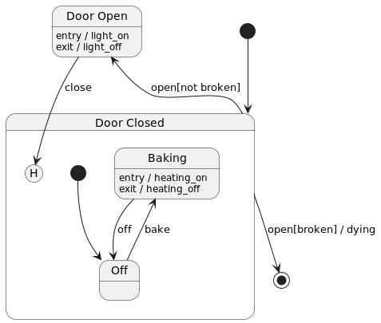

# hsm - Hierarchical State Machines in Go

Hsm is a Go language library for implementing hierarchical state machines.

The library implements a subset of UML state charts, with the following main features:
 * Hierarchical states - child states can be nested inside parent states,
   inheriting their behaviors (transitions), while allowing for specialization.
   This is also known as "behavioral inheritance".
 * State entry and exit actions.
 * External, local, and internal transitions.
 * Transition actions.
 * Shallow and deep history transitions.
 * Transition guard conditions.
 * Type-safe extended state.
 * PlantUML diagram generation.
 * High-performance.

## Quick start

The following example illustrates most of the library features:
 * Heater is turned on/off on entry to / exit from the Baking state.
 * Light is turned on every time the oven is opened, and turned off when it's closed.
 * Closing the door triggers transition to history state, which means we return to
   whatever state (Baking or Off) that the oven was in prior to opening the door.
 * When the door is opened for 101 time, the oven breaks!



```go
import (
	"fmt"
	"github.com/dragomit/hsm"
	"github.com/stretchr/testify/assert"
	"testing"
)

 // events
 const (
     evOpen = iota
     evClose
     evBake
     evOff
 )

 // extended state will keep track of how many times the oven door was opened
 type state struct {
     opened int
 }

 // Define state machine object which holds the state hierarchy.
 // State machine is parameterized by the extended state. If you don't need extended state, use struct{}.
 sm := hsm.StateMachine[*state]{}

 // Actions are functions that take hsm.Event and extended state, and return no result
 heatingOn := func(e hsm.Event, s *state) { fmt.Println("Heating On") }
 heatingOff := func(e hsm.Event, s *state) { fmt.Println("Heating Off") }
 lightOn := func(e hsm.Event, s *state) { s.opened++; fmt.Println("Light On") }
 lightOff := func(e hsm.Event, s *state) { fmt.Println("Light Off") }
 dying := func(e hsm.Event, s *state) { fmt.Println("Giving up a ghost") }

 // Transition guards are functions taking hsm.Event and extended state, and returning bool.
 // Transition takes place if guard returns true.
 isBroken := func(e hsm.Event, s *state) bool { return s.opened == 100 }
 isNotBroken := func(e hsm.Event, s *state) bool { return !isBroken(e, s) }

 // Create the states, and assign them entry and exit actions as necessary
 // Also mark any states that are targets of automatic initial transitions.
 doorOpen := sm.State("Door Open").Entry("light_on", lightOn).Exit("light_off", lightOff).Build()
 doorClosed := sm.State("Door Closed").Initial().Build()
 baking := doorClosed.State("Baking").Entry("heating_on", heatingOn).Exit("heating_off", heatingOff).Build()
 off := doorClosed.State("Off").Initial().Build()

 // Create transitions.
 doorClosed.Transition(evOpen, doorOpen).Guard("not broken", isNotBroken).Build()
 // Transition to nil state terminates the state machine.
 doorClosed.Transition(evOpen, nil).Guard("broken", isBroken).Action("dying", dying).Build()

 // When door is closed, we return to whichever state we were previously in.
 // We accomplish that using a history transition (either deep or shallow history transition works here).
 doorOpen.Transition(evClose, doorClosed).History(hsm.HistoryShallow).Build()
 baking.AddTransition(evOff, off)
 off.AddTransition(evBake, baking)

 // State machine must be finalized before it can be used.
 sm.Finalize()

 // Print PlantUML diagram for this state machine.
 evMapper := func(ev int) string {
     return []string{"open", "close", "bake", "off"}[ev]
 }
 fmt.Println(sm.DiagramPUML(evMapper))

 // Create an instance of this state machine.
 smi := hsm.StateMachineInstance[*state]{SM: &sm, Ext: &state{}}

 // Initialize the instance. The initial event is merely what's passed to the state entry
 // functions, but is otherwise not delivered to the state machine. 
 // To drive this point home, we'll use an invalid event id.
 smi.Initialize(hsm.Event{EventId: -1})

 // smi.Current() == off

 smi.Deliver(hsm.Event{EventId: evBake}) // prints "Heating On"
 // smi.Current() == baking

 smi.Deliver(hsm.Event{EventId: evOpen}) // prints "Heating Off", "Light On"
 // smi.Current() == doorOpen

 smi.Deliver(hsm.Event{EventId: evClose}) // prints "Light Off", "Heating On"
 // smi.Current() == baking

 // open and close 99 more times
 for i := 0; i < 99; i++ {
     smi.Deliver(hsm.Event{EventId: evOpen})
     smi.Deliver(hsm.Event{EventId: evClose})
 }
 // smi.Ext.opened == 100
 // smi.Current() == baking

 // next time we open the door it should break, and state machine should terminate
 smi.Deliver(hsm.Event{EventId: evOpen}) // prints "Giving up a ghost"
 // smi.Current() == nil
 // note: if any further events are delivered to the state machine, they will be ignored
``` 


